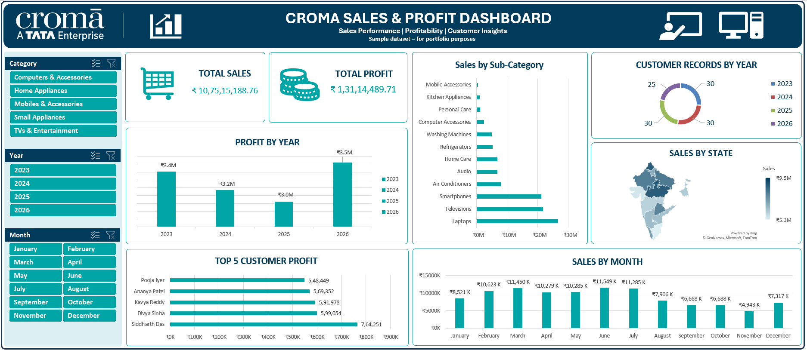

# Croma Sales & Profit Dashboard

## 📊 Project Overview
An interactive Sales & Profit Dashboard created using Microsoft Excel to analyze sales performance, profitability, customer insights, product categories, and state-wise sales.

## 🎯 Objective
The objective of this project is to transform raw sales data into an interactive dashboard that helps identify sales trends, profitable customers, top-performing product categories, and state-wise performance.

## 🛠️ Tools & Technologies
- Microsoft Excel
- PivotTables
- PivotCharts
- Slicers
- Map Chart
- Excel Formulas
- Data Cleaning & Analysis

## 🖼️ Dashboard Preview

## 📈 Dashboard Features
- Total Sales
- Total Profit
- Profit by Year
- Sales by Sub-Category
- Customer Count
- Sales by State using Map Chart
- Top 5 Customers by Profit
- Monthly Sales Analysis
- Interactive Category, Year and Month Slicers

## 🔍 Key Insights
- Compare yearly profit performance.
- Identify top-performing product sub-categories.
- Analyze customer profitability.
- Understand state-wise sales performance.
- Track monthly sales trends.
- Filter the entire dashboard using interactive slicers.

## 📂 Project File
The Excel workbook contains the complete dataset, analysis, PivotTables, charts, slicers, and interactive dashboard.

## 💡 Skills Demonstrated
- Data Analysis
- Data Visualization
- Excel Dashboard Development
- PivotTable & PivotChart Analysis
- Interactive Reporting
- Business Insights

## 👨‍💻 Author
**Tejas Kadam**
